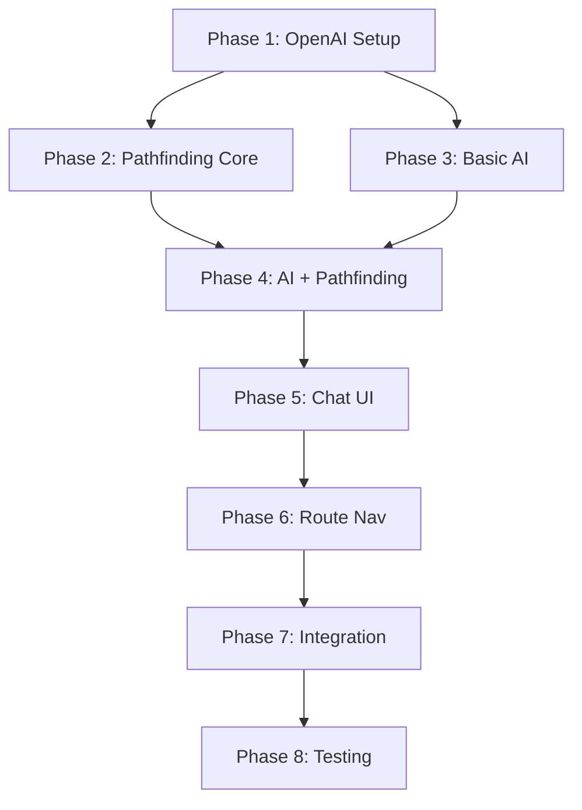

# Phase Restructuring Summary

## What Changed?

### Original Structure (Phase 2 Problem)
```
Phase 1: Setup (15 min)
Phase 2: Server Function (20 min) ← Too simple, no pathfinding
Phase 3: Chat Component (30 min) ← Would need major rework later
Phase 4: Integration (15 min)
Phase 5: Testing (15 min)

Total: 1h 35min
Problem: Direct jumping, poor UX ❌
```

### New Structure (With Pathfinding)
```
Phase 1: Setup (15 min)
Phase 2: Pathfinding Algorithm (45 min) ⭐ NEW
Phase 3: Basic AI Server (20 min) ⭐ SPLIT FROM OLD PHASE 2
Phase 4: Pathfinding Integration (30 min) ⭐ NEW
Phase 5: Chat UI Only (30 min) ⭐ SPLIT FROM OLD PHASE 3
Phase 6: Route Navigation (60 min) ⭐ NEW
Phase 7: Integration (15 min) [unchanged]
Phase 8: Testing & Deployment (45 min) [expanded]

Total: 6 hours
Result: Sequential navigation, excellent UX ✅
```

---

## Why This Order?

### Architectural Logic



**Key Decisions:**

1. **Pathfinding BEFORE AI** (Phase 2)
   - Independent testing
   - No AI coupling
   - Pure algorithm focus
   - Fast iteration

2. **Split AI into 2 phases** (Phase 3 & 4)
   - Phase 3: Basic function calling (simple, fast)
   - Phase 4: Add pathfinding (complex, testable separately)
   - Easier to debug issues

3. **Split Chat into 2 phases** (Phase 5 & 6)
   - Phase 5: UI only (messages, input, controls)
   - Phase 6: Route visualization (complex sequential logic)
   - UI works before adding navigation complexity

---

## What Each Phase Delivers

### Phase 1: Setup (15 min)
**Deliverable:** OpenAI API working
- Account created
- API key configured
- SDK installed
- Connection tested

**Files:** `.env.local`, `package.json`

---

### Phase 2: Pathfinding (45 min) ⭐ NEW
**Deliverable:** Working BFS algorithm
- Graph neighbor extraction
- Breadth-first search
- Path reconstruction
- Unit tests passing

**Files:**
- `src/lib/pathfinding.ts` (new)
- `src/lib/__tests__/pathfinding.test.ts` (new)

**Why now?**
- Independent of AI
- Can test exhaustively
- Used by Phase 4

**Example Output:**
```typescript
findPath("a-f1-north-entrance", "library-f1-entrance")
// Returns: {
//   path: ["a-f1-north-entrance", "a-f1-south-1", ..., "library-f1-entrance"],
//   distance: 7
// }
```

---

### Phase 3: Basic AI Server (20 min) ⭐ SPLIT
**Deliverable:** AI responds to queries
- OpenAI function calling configured
- Simple photoId return
- Error handling
- NO pathfinding yet

**Files:**
- `src/lib/ai.ts` (new, basic version)

**Why split from pathfinding?**
- Test AI independently
- Verify OpenAI integration
- Fast iteration on prompts
- Add complexity in Phase 4

**Example:**
```typescript
getChatResponse([{role: 'user', content: 'Take me to library'}], currentLoc)
// Returns: {
//   message: "I'll take you there!",
//   functionCall: {
//     name: 'navigate_to',
//     arguments: { photoId: 'library-f1-entrance' }
//   }
// }
```

---

### Phase 4: Pathfinding Integration (30 min) ⭐ NEW
**Deliverable:** AI returns complete routes
- Enhance `FunctionCall` interface
- Calculate paths server-side
- Include path metadata
- Handle "no path" errors

**Files:**
- `src/lib/ai.ts` (enhance)

**Why separate phase?**
- Pathfinding is complex
- Easy to debug integration issues
- Can compare with/without paths
- Backwards compatible

**Enhanced Output:**
```typescript
getChatResponse([{role: 'user', content: 'Take me to library'}], currentLoc)
// Returns: {
//   message: "I'll guide you there!",
//   functionCall: {
//     name: 'navigate_to',
//     arguments: {
//       photoId: 'library-f1-entrance',
//       path: ["a-f1-north-entrance", "a-f1-south-1", ...],
//       distance: 7,
//       routeDescription: "Route found: 7 steps from A F1 to LIBRARY F1"
//     }
//   }
// }
```

---

### Phase 5: Chat UI Only (30 min) ⭐ SPLIT
**Deliverable:** Working chat interface
- Floating window
- Message display
- Input/submit
- Loading states
- Minimize/maximize/close
- Simple direct navigation (no route)

**Files:**
- `src/components/chat/AICampusChat.tsx` (new, basic version)

**Why without route nav?**
- UI testing independent of navigation logic
- Fast visual iteration
- Simpler state management
- Add complexity in Phase 6

**What it does:**
- Shows chat messages ✅
- Accepts user input ✅
- Displays AI responses ✅
- Calls `onNavigate(photoId)` directly ✅
- NO sequential navigation yet ⏱️

---

### Phase 6: Route Navigation (60 min) ⭐ NEW
**Deliverable:** Sequential path visualization
- Step-by-step navigation
- Progress indicator
- Route preview messages
- Skip button
- Speed controls

**Files:**
- `src/components/chat/AICampusChat.tsx` (enhance)

**Why separate phase?**
- Most complex logic
- Async timing challenges
- Needs thorough testing
- UI already working (Phase 5)

**What it adds:**
- `navigateAlongPath()` function
- Route state management
- Progress overlay UI
- Timer management
- Cancellation handling

**User Experience:**
```
User: "Take me to library"
AI: "Route found: 7 steps. Starting navigation..."
[Progress Bar: Step 1 of 7]
→ Navigate to photo 2
[Progress Bar: Step 2 of 7]
→ Navigate to photo 3
...
[Progress Bar: Step 7 of 7]
→ Navigate to library
AI: "You've arrived! 🎯"
```

---

### Phase 7: Integration (15 min) [UNCHANGED]
**Deliverable:** AI in main app
- Add `<AICampusChat>` to `index.tsx`
- Wire up `currentPhotoId`
- Wire up `jumpToPhoto` callback
- Test complete flow

**Files:**
- `src/routes/index.tsx` (modify)

**No changes from original plan!**

---

### Phase 8: Testing & Deployment (45 min) [EXPANDED]
**Deliverable:** Production-ready system
- Pathfinding unit tests
- Integration tests
- End-to-end testing
- Performance validation
- Production deployment

**Files:**
- Test files
- Documentation

**Added testing:**
- BFS algorithm tests
- Path finding scenarios
- Route navigation tests
- Multi-building paths
- Elevator/stairs paths

---

## Breaking Changes from Original Plan

### Phase 2 (Original) → Phases 2, 3, 4 (New)

**Old Phase 2 Code:**
```typescript
// Simple, no pathfinding
export interface FunctionCall {
  name: string
  arguments: { photoId: string }
}

// Direct navigation
if (result.functionCall) {
  onNavigate(result.functionCall.arguments.photoId) // JUMP!
}
```

**New Phase 2:** Pathfinding algorithm (separate file)
**New Phase 3:** Same as old Phase 2 (basic AI)
**New Phase 4:** Enhance AI with pathfinding

**New Phase 4 Code:**
```typescript
// Enhanced with path data
export interface FunctionCall {
  name: string
  arguments: {
    photoId: string,
    path?: string[],      // NEW
    distance?: number,    // NEW
    routeDescription?: string // NEW
  }
}
```

### Phase 3 (Original) → Phases 5, 6 (New)

**Old Phase 3 Code:**
```typescript
// Simple direct navigation
if (result.functionCall) {
  onNavigate(result.functionCall.arguments.photoId)
}
```

**New Phase 5:** UI only, keeps simple navigation
**New Phase 6:** Add sequential route logic

**New Phase 6 Code:**
```typescript
// Sequential navigation
if (result.functionCall?.arguments.path) {
  navigateAlongPath(path, 800) // Step by step!
}
```

---

## Migration from Original Phases

### If You Started Original Implementation

**Completed Phase 1 (Setup)?**
→ ✅ No changes needed, continue to new Phase 2

**Completed Phase 2 (Server Function)?**
→ ⚠️ Need to add pathfinding:
1. Complete new Phase 2 (pathfinding)
2. Enhance your server function (new Phase 4)
3. Keep existing Phase 3 code

**Completed Phase 3 (Chat UI)?**
→ ⚠️ Need to add route navigation:
1. Your UI is fine (new Phase 5)
2. Add sequential navigation (new Phase 6)

---

## Time Comparison

| Phase | Original | New | Change |
|-------|----------|-----|--------|
| 1. Setup | 15 min | 15 min | - |
| 2. Server Function | 20 min | - | Split → |
| **2. Pathfinding** | - | **45 min** | **+ NEW** |
| **3. Basic AI** | - | **20 min** | **+ Split** |
| **4. AI + Pathfinding** | - | **30 min** | **+ NEW** |
| 3. Chat Component | 30 min | - | Split → |
| **5. Chat UI** | - | **30 min** | **+ Split** |
| **6. Route Nav** | - | **60 min** | **+ NEW** |
| 4. Integration | 15 min | 15 min | - |
| 5. Testing | 15 min | 45 min | Expanded |
| **TOTAL** | **1h 35min** | **6h** | **+4h 25min** |

**Cost/Benefit:**
- +4.5 hours additional work
- Professional sequential navigation
- Educational user experience
- No disorienting jumps
- Users learn campus layout

**Still way better than:**
- Copilot Studio: 21 hours (blocked) ❌
- Manual implementation: 40+ hours ❌

---

## Quick Reference

### What Phase Am I In?

```
[ ] Phase 1: Do I have OpenAI working?
    ↓ YES
[ ] Phase 2: Can I calculate paths between locations?
    ↓ YES
[ ] Phase 3: Does AI respond to navigation questions?
    ↓ YES
[ ] Phase 4: Does AI return path arrays?
    ↓ YES
[ ] Phase 5: Can I see chat messages?
    ↓ YES
[ ] Phase 6: Does navigation step through route?
    ↓ YES
[ ] Phase 7: Is chat integrated in main app?
    ↓ YES
[ ] Phase 8: Tests passing and deployed?
    ↓ YES
✅ COMPLETE!
```

### Where Should I Start?

**Never implemented anything yet?**
→ Start at Phase 1

**Have OpenAI working?**
→ Start at Phase 2 (pathfinding)

**Have basic AI responses working?**
→ Start at Phase 4 (pathfinding integration)

**Have chat UI but jumps directly?**
→ Start at Phase 6 (route navigation)

---

## Success Metrics

### After Each Phase

| Phase | Success Criteria |
|-------|------------------|
| 1 | OpenAI API call succeeds |
| 2 | `findPath()` returns valid route array |
| 3 | AI returns `navigate_to` function call |
| 4 | Function call includes `path` array |
| 5 | Chat messages display correctly |
| 6 | Navigation steps through path sequentially |
| 7 | Chat appears in main app |
| 8 | All tests pass, deployed to production |

### Final System Validation

✅ **Functional:**
- User asks: "Take me to library"
- AI calculates 7-step route
- Navigation shows progress: "Step 1 of 7..."
- User arrives at library entrance
- Confirmation message displays

✅ **Performance:**
- Pathfinding: <10ms
- AI response: <3s
- Route navigation: Smooth transitions
- No UI freezing

✅ **User Experience:**
- Spatial awareness maintained
- No disorienting jumps
- Progress clearly communicated
- Can skip long routes
- Mobile responsive

---

## Documentation Updates

### Files to Read

1. **`IMPLEMENTATION_PLAN.md`** (this file)
   - Complete phase breakdown
   - Step-by-step instructions
   - Code examples for each phase

2. **`PATHFINDING_ANALYSIS.md`**
   - Deep dive on BFS algorithm
   - Graph structure analysis
   - Performance considerations

3. **`phase-1-setup.md`** [unchanged]
   - OpenAI account setup
   - API key configuration

4. **`phase-2-pathfinding.md`** [NEW - needs creation]
   - BFS implementation
   - Unit tests

5. **`phase-3-basic-ai.md`** [NEW - needs creation]
   - Server function basics
   - Function calling

6. **`phase-4-ai-pathfinding.md`** [NEW - needs creation]
   - Pathfinding integration
   - Enhanced interfaces

7. **`phase-5-chat-ui.md`** [NEW - needs creation]
   - Chat interface
   - Message display

8. **`phase-6-route-nav.md`** [NEW - needs creation]
   - Sequential navigation
   - Progress UI

9. **`phase-7-integration.md`** [similar to old phase-4]
   - Main app integration

10. **`phase-8-testing.md`** [expanded from old phase-5]
    - Testing strategy
    - Deployment

---

## Questions & Answers

**Q: Why not keep it simple and just jump?**
A: Users get disoriented. Sequential navigation is educational and maintains spatial context.

**Q: Is 6 hours too long?**
A: Still 71% faster than Copilot Studio (21h) and delivers professional UX.

**Q: Can I skip pathfinding phases?**
A: Not recommended. Direct jumping provides poor user experience.

**Q: What if I want faster navigation?**
A: Phase 6 includes speed controls (slow/normal/fast).

**Q: Can users skip route visualization?**
A: Yes! Phase 6 includes skip button.

**Q: What about very long routes (20+ steps)?**
A: Speed controls + skip button handle this well.

**Q: Will this work on mobile?**
A: Yes, all phases include responsive design considerations.

---

## Next Steps

**Ready to start?**

1. Read `IMPLEMENTATION_PLAN.md` for detailed instructions
2. Start with Phase 1 if you haven't set up OpenAI
3. Follow phases in order - each builds on the previous
4. Test thoroughly after each phase
5. Each phase is independently deployable!

**Need help?** Each phase has detailed code examples and testing instructions.

---

**Good luck with your implementation!** 🚀
