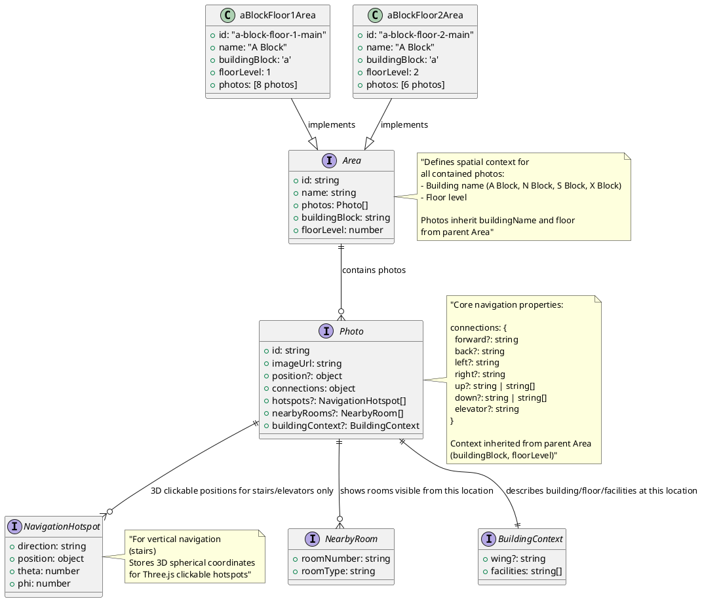

# VR Campus Tour - Area System Diagram

## Area Navigation System (Copy this block)

```plantuml
@startuml

interface Area {
  +id: string
  +name: string
  +photos: Photo[]
  +buildingBlock: string
  +floorLevel: number
}

interface Photo {
  +id: string
  +imageUrl: string
  +position?: object
  +connections: object
  +hotspots?: NavigationHotspot[]
  +nearbyRooms?: NearbyRoom[]
  +buildingContext?: BuildingContext
}

interface NavigationHotspot {
  +direction: string
  +position: object
  +theta: number
  +phi: number
}

interface NearbyRoom {
  +roomNumber: string
  +roomType: string
}

interface BuildingContext {
  +wing?: string
  +facilities: string[]
}

class aBlockFloor1Area {
  +id: "a-block-floor-1-main"
  +name: "A Block"
  +buildingBlock: 'a'
  +floorLevel: 1
  +photos: [8 photos]
}

class aBlockFloor2Area {
  +id: "a-block-floor-2-main"
  +name: "A Block"
  +buildingBlock: 'a'
  +floorLevel: 2
  +photos: [6 photos]
}

Area ||--o{ Photo : "contains photos"
Photo ||--o{ NavigationHotspot : "3D clickable positions for stairs/elevators only"
Photo ||--o{ NearbyRoom : "shows rooms visible from this location"
Photo ||--|| BuildingContext : "describes building/floor/facilities at this location"
aBlockFloor1Area --|> Area : "implements"
aBlockFloor2Area --|> Area : "implements"

note right of NavigationHotspot : "For vertical navigation\n(stairs)\nStores 3D spherical coordinates\nfor Three.js clickable hotspots"

note right of Photo : "Core navigation properties:\n\nconnections: {\n  forward?: string\n  back?: string\n  left?: string\n  right?: string\n  up?: string | string[]\n  down?: string | string[]\n  elevator?: string\n}\n\nContext inherited from parent Area\n(buildingBlock, floorLevel)"

note right of Area : "Defines spatial context for\nall contained photos:\n- Building name (A Block, N Block, S Block, X Block)\n- Floor level\n\nPhotos inherit buildingName and floor\nfrom parent Area"

@enduml
```