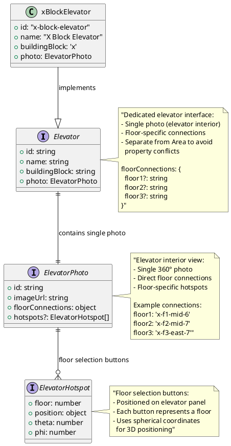

# VR Campus Tour - Elevator System Diagram

## Elevator Navigation System (Copy this block)

```plantuml
@startuml

interface Elevator {
  +id: string
  +name: string
  +buildingBlock: string
  +photo: ElevatorPhoto
}

interface ElevatorPhoto {
  +id: string
  +imageUrl: string
  +floorConnections: object
  +hotspots?: ElevatorHotspot[]
}

interface ElevatorHotspot {
  +floor: number
  +position: object
  +theta: number
  +phi: number
}

class xBlockElevator {
  +id: "x-block-elevator"
  +name: "X Block Elevator"
  +buildingBlock: 'x'
  +photo: ElevatorPhoto
}

Elevator ||--|| ElevatorPhoto : "contains single photo"
ElevatorPhoto ||--o{ ElevatorHotspot : "floor selection buttons"
xBlockElevator --|> Elevator : "implements"

note right of Elevator : "Dedicated elevator interface:\n- Single photo (elevator interior)\n- Floor-specific connections\n- Separate from Area to avoid\n  property conflicts\n\nfloorConnections: {\n  floor1?: string\n  floor2?: string\n  floor3?: string\n}"

note right of ElevatorHotspot : "Floor selection buttons:\n- Positioned on elevator panel\n- Each button represents a floor\n- Uses spherical coordinates\n  for 3D positioning"

note right of ElevatorPhoto : "Elevator interior view:\n- Single 360° photo\n- Direct floor connections\n- Floor-specific hotspots\n\nExample connections:\nfloor1: 'x-f1-mid-6'\nfloor2: 'x-f2-mid-7'\nfloor3: 'x-f3-east-7'"

@enduml
```